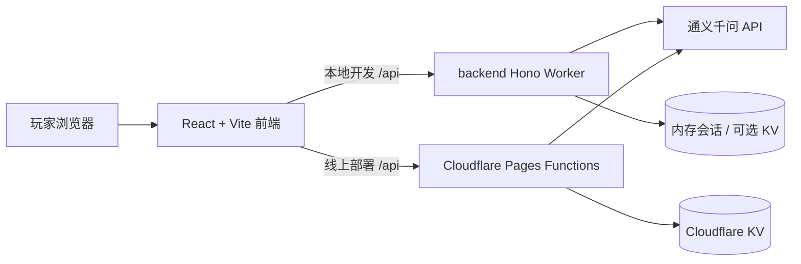

# 海龟汤游戏

一个基于通义千问的多人海龟汤推理游戏。

项目现在分成两条后端路径：

- `functions/`：Cloudflare Pages Functions，面向线上部署
- `backend/`：Wrangler + Hono，本地开发时给前端提供 `/api` 接口

## 技术栈

### 前端

- 语言：TypeScript
- 框架：React 18
- 构建工具：Vite 5
- 主要目录：`frontend/src`

### 后端

- 语言：TypeScript
- 框架：Hono
- 运行时：
  - 线上：Cloudflare Pages Functions
  - 本地：Cloudflare Worker（通过 `wrangler dev` 启动 `backend/`）
- AI 接口：通义千问兼容 OpenAI Chat Completions
- 会话存储：
  - 线上优先使用 Cloudflare KV
  - 本地未配置 KV 时自动回退到内存存储

## 架构图



## 仓库结构

```text
.
├─ frontend/                 React 前端
│  ├─ src/App.tsx            主页面
│  ├─ src/api/client.ts      前端 API 客户端
│  └─ src/styles/theme.css   样式
├─ backend/                  本地开发用 Worker 后端
│  ├─ src/index.ts           API 入口
│  ├─ src/services/          会话和通义千问封装
│  └─ wrangler.toml
├─ functions/                线上 Cloudflare Pages Functions
│  ├─ api/                   路由
│  └─ _shared/               题库、提示词、会话工具、AI 客户端
└─ package.json              Workspace 脚本
```

## API 概览

### 题库

- `GET /api/turtle-soups`
- `GET /api/turtle-soups/:id`

### 房间

- `POST /api/sessions`
- `GET /api/sessions/:id`
- `POST /api/sessions/:id/ask`

## 本地开发

### 1. 安装依赖

```bash
npm install
```

### 2. 配置通义千问 Key

把 [backend/.dev.vars.example](backend/.dev.vars.example) 复制为 `backend/.dev.vars`，填入你的配置：

```bash
QIANWEN_API_KEY=你的密钥
QIANWEN_MODEL=qwen-plus
QIANWEN_ENDPOINT=https://dashscope.aliyuncs.com/compatible-mode/v1/chat/completions
```

### 3. 启动

```bash
npm run dev
```

默认行为：

- 前端运行在 Vite 开发服务器
- 前端把 `/api` 代理到本地 `wrangler dev`
- 房间数据在未配置 KV 时会保存在内存里

## 线上部署

线上主路径仍然是根目录的 `functions/`。

需要在 Cloudflare 里配置：

- `QIANWEN_API_KEY`
- 可选：`QIANWEN_MODEL`
- 可选：`QIANWEN_ENDPOINT`
- 可选 KV 绑定：`SESSIONS_KV`

如果没有绑定 `SESSIONS_KV`，当前代码也可以运行，但房间会话只会存在于单个运行实例的内存生命周期内，不适合正式多人场景。

## 常用脚本

```bash
npm run dev
npm run typecheck
npm run build
npm run check
```

## 这次优化做了什么

- 移除了硬编码 API Key，改为从运行时环境读取
- 修复了本地开发时缺少 `sessions` 接口的问题
- 为本地开发补上了内存会话存储回退
- 修复了根脚本在 Windows 下并行运行不稳定的问题
- 补上了前后端类型检查脚本
- 修复了前端 304 响应缓存缺失和未读消息重复计数问题
